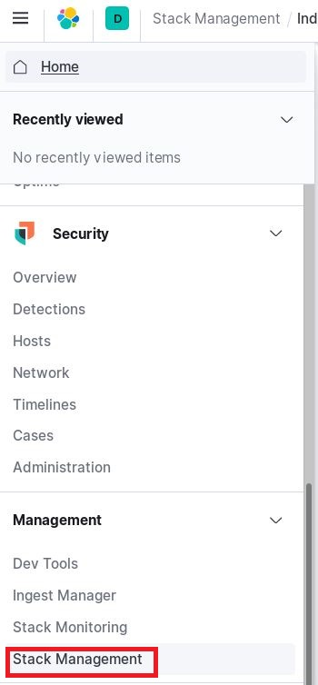
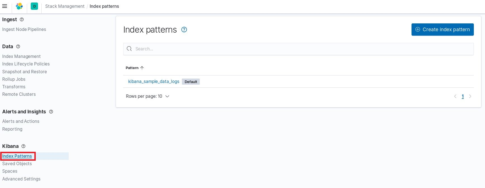
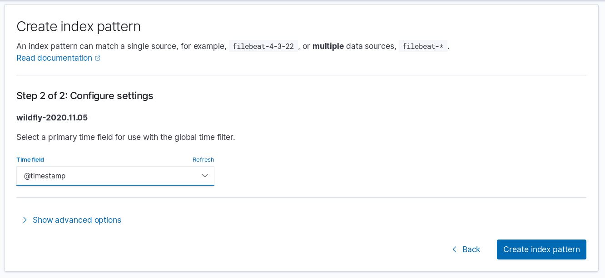
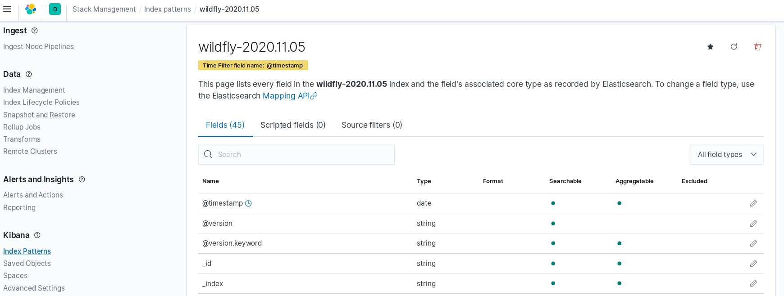
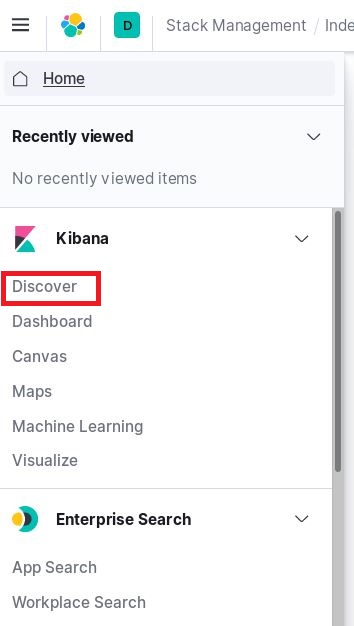
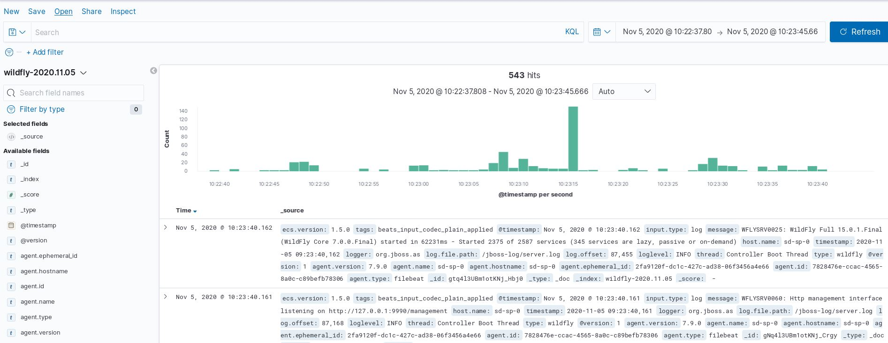
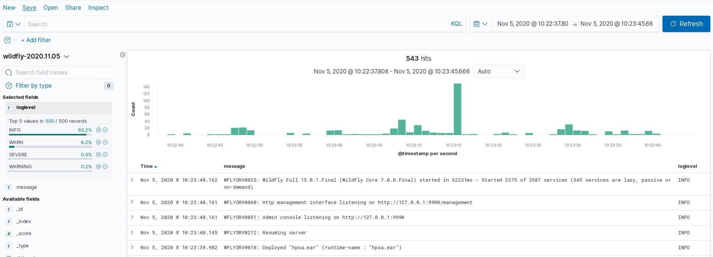
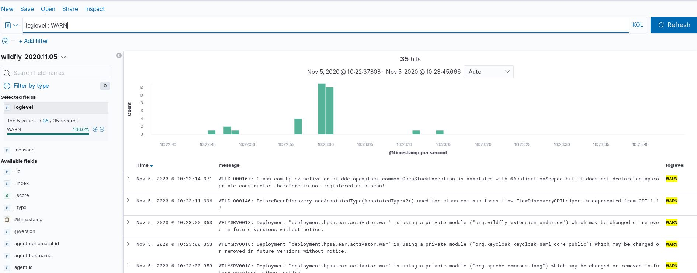

# Use Kibana to display SD logs information

Kibana is the UI tool that allows you to explore and visualize over the SD log data added in Elasticsearch Cluster. The Elasticsearch tool serves as the database for the SD log data.

The main features of Kibana are data querying and analysis. Kibana’s visualization features allow you to display data using heat maps, line graphs, histograms and pie charts. With various methods, you can search the data stored in Elasticsearch for root cause diagnostics on the SD pods.

You can check if the SD logs indexes were created and stored in Elasticsearch using the Kibana web interface, to access to Kibana UI open the following URL in your browser:

    http://<kubernetes_cluster_ip>:30033/

where 30033 is the external port opened in our testing environment at the time of writing this. For a production environment check with you K8S cluster administrator.

 - Then select "Stack Management" under the main menu:

 - select "Index Patterns" on the the next menu:

 - select "Create Index Patterns" .

 - select a pattern from the list and click "Next step" .

 - select the Time field and click "Create Index pattern".

 - now your Kibana index has been created. Come back to the main menu to display the results.

 - Select "Discover" on the main menu:

 - select your new index from the list and choose a time frame that contains data: 

 - under "Available fields" select "Message" and "loglevel", that will add some useful info to the table. Add as many fields as you want.

 - finally lets add some query to filter the information that is displayed on the table. If you type the following in the query text box: loglevel: WARN

  - only the warning messages will be displayed.

 - Now you can create your own Dashboards using the info contained in the index.
