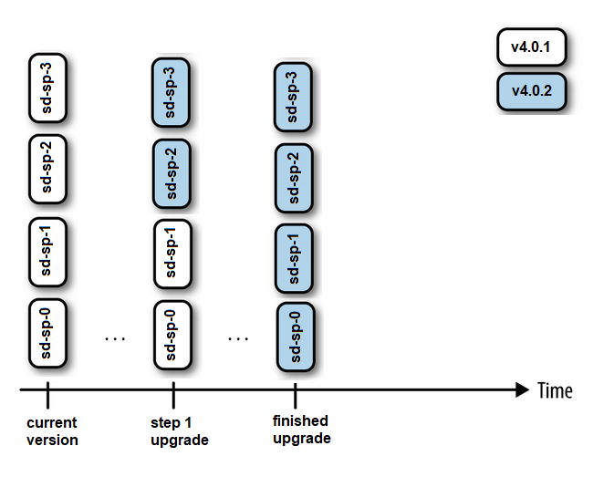
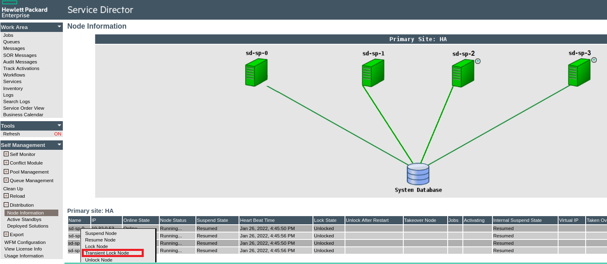
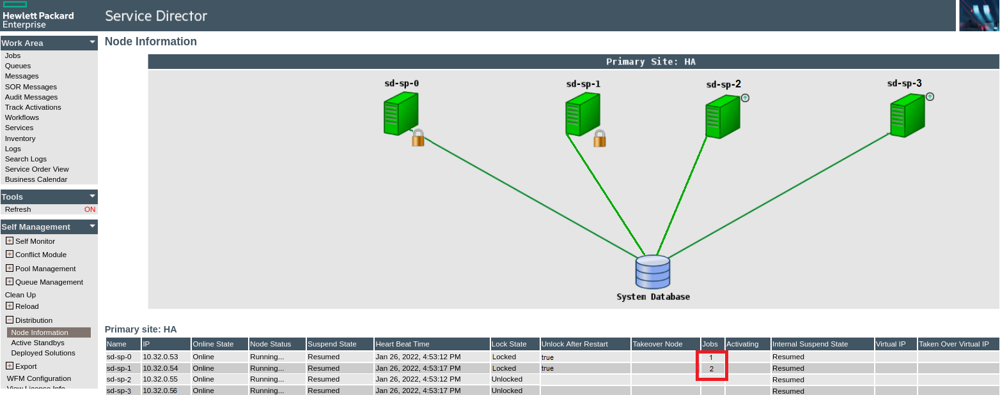

# HPE Service Director Helm Chart Rolling Update guide for Kubernetes

**Table of Contents**

  - [Introduction](#introduction)
  - [General Preparation](#general-preparation)
  - [Kubernetes Rolling update strategy](#kubernetes-rolling-update-strategy)


## Introduction

This document describes how to manually execute a rolling update of your  HPE Service Director (HPE SD) helm chart installation between consecutive minor versions. 

Rolling updates allow HPE SD helm chart deployments updates to take place with zero downtime by incrementally updating Pods instances with new ones. The number of Pods that will be unavailable during the update is one, the update process will shutdown one of the instances and it won't move to next one until the current one has been updated.

To complete the HPE SD helm chart update successfully you need to complete several steps in order. The update process will finish when all SA nodes will be running with the new version. Therefore at some point during the update you will have some HPE SD nodes running the old version and some others running the new one. The update process contains a procedure to distribute the new workflows between the updated HPE SD nodes.

During the HPE SD helm chart update the SA nodes will be upgraded too, before the Kubernetes update starts the SA cluster must already be running with the rolling upgrade flag set as described in the requirements section of this document.
More info regarding the SA rolling upgrade method can be found in HPE Service Director documentation under *Automated Installation and update > Installation > Rolling upgrade* 


## General Preparation

There are several steps necessary before you can start with upgrading your HPE SD helm chart instance.

### Requirements

- HPE Service Director Helm Chart Rolling update is only supported between minor updates of HPE SD. Therefore you are only allowed to updates to a consecutive minor version.
- The minimum number of sd-sp pods are 2. If you setup HPE SD helm chart in HA (high availability) the rolling update requires to be scaled to a minimum of 4 replicas for sd-sp pods before the Rolling update starts.
- All SD workflows in the old sd-sp version nodes/pods must finish before all nodes can be updated to the new version. If any of them do not finish you should check manually and take the proper actions. 
- sd-sp nodes running the old version must have been deployed with parameter enable_rolling_upgrade=true

Only an experienced Kubernetes administrator should perform these procedures. Complete the following sections in the order specified:


#### Backup the Database

First, backup the server database as described by the DB vendor. This is independent of the  update process but important in case something goes wrong.

#### Download HPE SD helm chart

Download the latest HPE SD helm chart release and store it in a different place  where your previous helm chart was placed.

## Kubernetes Rolling update strategy

Kubernetes rolling update is an automated update process. In this, the controller deletes and then recreates each of its pods. Pods get updated one at a time. While updating, the controller makes sure that an updated pod is running and is in ready state before updating its predecessor. The pods in the StatefulSet are updated in reverse ordinal order (same as pod termination order i.e from the largest ordinal to the smallest).

In Kubernetes, the `updateStrategy` contains one field for partitioning the rolling update. If a partition is specified, all provisioner pods with an ordinal greater than or equal to that of the provided partition will be updated and the pods with an ordinal that is less than the partition will not be updated. If the pods with an ordinal value less than the partition get deleted, then those pods will get recreated with the old definition/version.

The HPE SD rolling update needs to be done in two partitions, the first partition contain nodes `sd-sp-0` and `sd-sp-1` and the second partition contains the rest of nodes (it will be `sd-sp-3` and `sd-sp-4` in a HA setup of 4 nodes). The reason for this splitting is to ensure the remaining old workflows are stopped properly and there is always and availability partition where nodes can still receive new workflows to be executed.

This partitioning rolling update plays important role in keeping the service availability during the whole process.


  
## Step 1, activate update and update first partition  
  
To set the rolling update feature, we have to patch the existing statefulset with the update strategy

```
 kubectl patch sts sd-sp --patch '{"spec":{"updateStrategy": {"rollingUpdate": {"partition": X}}}}'
```

where X is an integer number. The strategy is to divide your SD cluster (with your sd-sp or sd-cl pods) in two different partitions: the first partition consists of node `sd-sp-0` (`sd-sp-0` and `sd-sp-1` if it is an HA setup)), it contains all the nodes not updated during the first part of the process, The second partition will contain the rest of the nodes and they will be updated during the first part of the process.

Therefore x will be 1 in a standard deployment and it will be 2 in case of an HA deployment. Picture shows the stages of the updated process:



The next step consist on locking all the sd-sp nodes of the second partition: that means all nodes but the `sd-sp-0` node (`sd-sp-0` and `sd-sp-1` in HA configuration). You can do it from the command line or using the SA UI. The lock to use is Transient Lock.

The tool used to perform the update is Helm, during the installation of the HPE SD Helm chart you use the command "helm install" with a set of parameters. During the update you will use `helm upgrade` with the same set of parameters. Use the following command to start the process:

```
helm upgrade sd-helm sd-chart-repo/sd-helm-chart --set enable_rolling_upgrade=true,...


```
- More info about enable_rolling_upgrade can be found [here](../helm/charts/README.md#common-parameters)
- Remember to add the set of parameters you used during the "helm install" process for the current version.
- The path sd-chart-repo/sd-helm-chart points to the HPE SD helm repo, as stated in [deployment guide ](../helm/charts/README.md#deploying-sd-provisioner). You can update your repo with the latest version with the comamnd "helm repo update"


The Kubernetes rolling update is an automated update process. In this, the controller deletes and then recreates each of the pods containing the old version . Pods get updated one at a time. While updating, the controller makes sure that an updated pod is running and is in ready state before updating its predecessor. The pods in the StatefulSet are updated in reverse ordinal order(same as pod termination order i.e from the largest ordinal to the smallest one), the last pod to be updated will be pod `sd-sp-1` (`sd-sp-2` in an HA deployment)

You must wait until all the nodes of the update partition are updated before you move to the next step. You can check if a pod has been updated with the new version using this command:

```
kubectl get pod sd-sp-4 -o yaml | grep image:
```

That command will display the image version of the pod `sd-sp-4`. You have to check the version for each node in the partition.

The first phase of the update will finish when all the nodes of the updated partition have a status of _RUNNING_ and the image version is the new one.


## Step 2, lock old version nodes

now we have to patch the existing statefulset with the update strategy to upgrade the remaining nodes:

```
 kubectl patch sts sd-sp --patch '{"spec":{"updateStrategy": {"rollingUpdate": {"partition": 0}}}}'
```

Before the partition containing the remaining old nodes, with `sd-sp-0` and `sd-sp-1`, is updated it is important to lock those nodes (This is the only manual step) and wait until those nodes are not running any workflows. You can do a Transient Lock using the SA UI console:

First you lock the `sd-sp-0` node (`sd-sp-0` and `sd-sp-1` in HA configuration):



  
Then you wait until there is no workflows running in the `sd-sp-0` node (`sd-sp-0` and `sd-sp-1` in HA configuration):




## Step 3, finish the update

Now we have to update the remaining nodes that still run with the HPE SD old version. You will use `helm upgrade` with the same set of parameters as before.

Use the following command to start the process:

```
helm upgrade sd-helm sd-chart-repo/sd-helm-chart --set enable_rolling_upgrade=true,...
```

You must wait until all the remaining nodes are updated. You can check if a pod has been updated with the new version using this command:

```
kubectl get pod sd-sp-0 -o yaml | grep image:
```

That command will display the image version of the pod `sd-sp-0` You have to check the version for each node in the partition .

The update will finish when all the nodes of the upgrading partition have a status of RUNNING and the image version running inside the containers is the new one.


